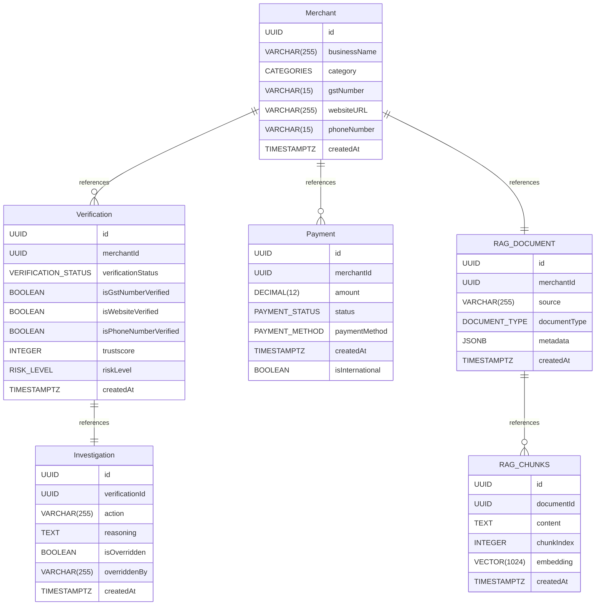

# MerchantIQ

MerchantIQ helps a platform figure out whether a merchant signing up is trustworthy or risky.

You give it a merchant's basic details (business name, GST number, website, phone number) and a document (like a business registration PDF). It then automatically:

- Checks whether the GST number, phone number, and website look valid and real
- Looks at the merchant's website itself to see if it's a genuine, operating business
- Looks at the merchant's payment history to spot suspicious patterns
- Reads the uploaded document and compares it against government compliance rules
- Combines all of this into a final decision — **Approve** or **Reject** — along with a simple explanation of why

## What's inside

This is a monorepo (one repo, multiple apps that work together) managed with [Turborepo](https://turborepo.dev).

| App | Folder | What it does | Default port |
| --- | --- | --- | --- |
| Backend | `apps/api` | The main server. Handles merchants, payments, document uploads, and runs the verification pipeline. | `4000` |
| Frontend | `apps/web` | The dashboard shown in the screenshots — view merchants, see risk scores, inspect investigations. | `3000` |
| ML service | `apps/ml-service` | A small Python service that scores payment behavior for fraud risk using a trained model. | `8000` |

The backend and frontend are the two apps you'll interact with directly. The ML service runs quietly in the background and is called by the backend.

## Architecture and Database Design

### Architecture Diagram


_End-to-end request flow: API routes → Inngest event triggers → the fan-out/fan-in pipeline described above → persisted verification and investigation records._

### Database Design




## Requirements

- Node.js (v24 or newer recommended)
- Python (for the ML service)
- PostgreSQL with the `pgvector` extension enabled
- Accounts/API keys for: Cloudinary, Inngest, Firecrawl, Mistral

## Setup

1. Clone the repo and install everything from the root:

   ```bash
   git clone https://github.com/NallyTHEdude/MerchantIQ-monorepo.git
   cd MerchantIQ-monorepo
   npm install
   ```

2. Set up the backend environment file:

   ```bash
   cd apps/api
   cp .env.example .env
   ```

   Fill in your database URL, `PORT` (uses default `4000`), and your Cloudinary/Inngest/Firecrawl/Mistral keys. Full details are in [`apps/api/README.md`](apps/api/README.md).

3. Set up the frontend environment file:

   ```bash
   cd ../web
   cp .env.example .env
   ```

   Set `NEXT_PUBLIC_BACKEND_URL=http://localhost:4000` so the frontend knows where the backend is running (Backend uses port `4000` by default).

4. Set up the ML service (one-time):

   ```bash
   cd ../..
   npm run ml:setup
   ```

5. Run the database migrations:

   ```bash
   cd apps/api
   npm run db:migrate
   ```

## Running the project

Each app runs separately. Open a few terminals from the repo root:

```bash
# Terminal 1 — backend (http://localhost:4000)
cd apps/api
npm run dev:server

# Terminal 2 — background job runner used by the backend
cd apps/api
npm run dev:inngest

# Terminal 3 — ML service (http://localhost:8000)
cd apps/ml-service
npm run dev

# Terminal 4 — frontend (http://localhost:3000)
cd apps/web
npm run dev
```

Once everything is running, open **http://localhost:3000** to use the dashboard.

You can also start the backend and frontend together from the root using Turborepo:

```bash
npm run dev
```

## Learn more

- Backend details (routes, database design, how the verification pipeline works): [`apps/api/README.md`](apps/api/README.md)
- API documentation (once the backend is running): `http://localhost:4000/api-docs`