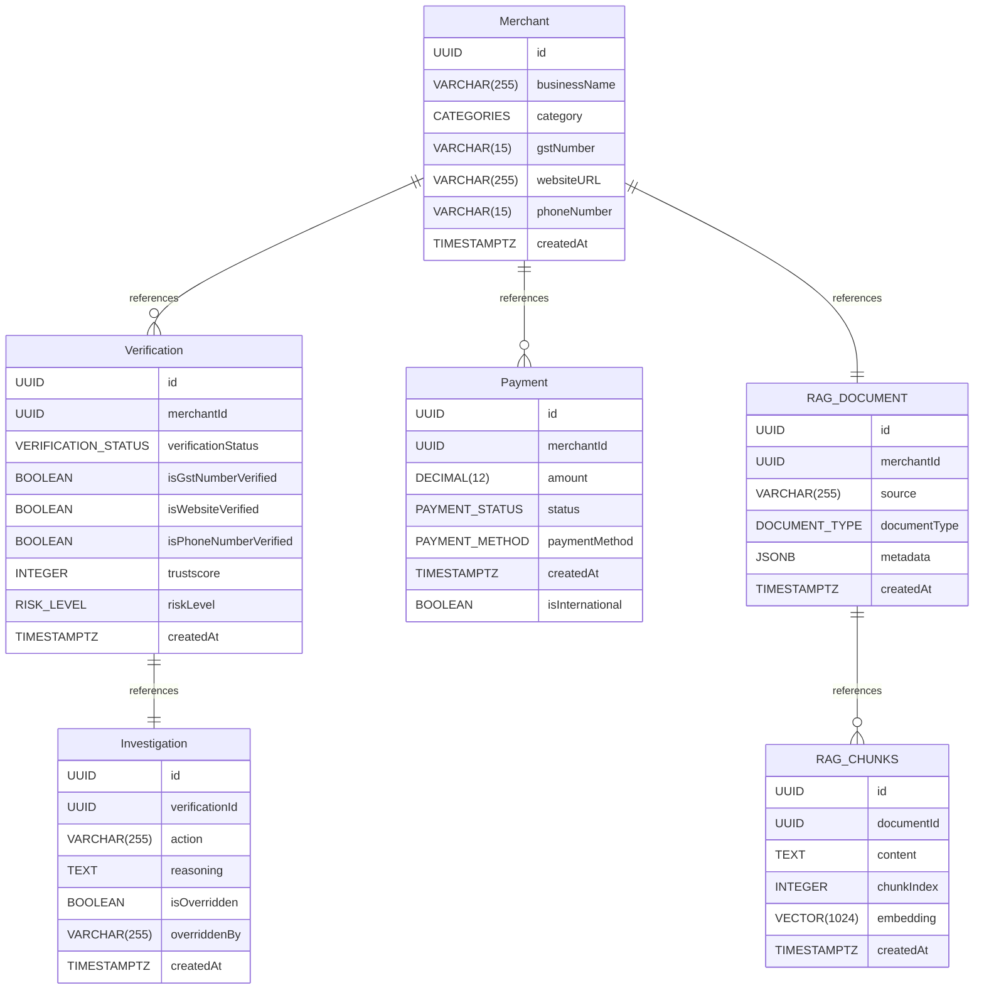

# Merchant Analysis API

REST API for merchant onboarding, payments, document uploads, and AI-assisted merchant verification.

Given a merchant's declared details (GST number, phone, website, category) and their submitted documents, the system runs identity checks, scrapes and investigates their website, scores transaction behavior for fraud risk, and produces a structured, evidence-grounded APPROVE/REJECT decision backed by retrieved government compliance material.

The API uses:

- Express and TypeScript
- PostgreSQL with Drizzle ORM and `pgvector` for embeddings
- Cloudinary for PDF storage
- Inngest for background, event-driven workflows
- Firecrawl (agentic web scraping) for website investigation
- Mistral LLM with structured output for RAG-based merchant analysis
- Langchain for orchestrating the RAG
- Swagger for API documentation

### Architecture Diagram


_End-to-end request flow: API routes → Inngest event triggers → the fan-out/fan-in pipeline described above → persisted verification and investigation records._

### Database Design



_Core schema: merchants, payments, verifications, RAG documents/chunks (pgvector), and investigations, and how they relate to one another._

## Requirements

- Node.js
- PostgreSQL with `pgvector`
- Cloudinary account
- Inngest CLI
- Firecrawl API key
- Mistral API key
- API keys and settings listed in the environment configuration

## Setup

From this directory:

```bash
npm install
```

Create a `.env` file with the required database, Cloudinary, Inngest, Firecrawl, LLM, and admin upload settings.

Run database migrations:

```bash
npm run db:migrate
```

Start the API and Inngest development server in separate terminals:

```bash
npm run dev:server
npm run dev:inngest
```

The API runs on the configured `PORT`. The Inngest dashboard is available at `http://localhost:8288`.

## API Documentation

Open Swagger UI at `http://localhost:<PORT>/api-docs`.

The raw OpenAPI document is available at `http://localhost:<PORT>/api-docs/json`.

Swagger includes request and response examples for every API route.

## Routes

- All routes use the `/api` prefix.
- Check routes documentation in swagger ui by running the api and going to `http://localhost:<PORT>/api-docs`.

## How It Works

Verification is a fan-out / fan-in pipeline orchestrated with Inngest, so independent checks run concurrently instead of blocking on each other.

Requesting a merchant verification publishes a `merchant-analysis/requested` event. A top-level orchestrator function invokes two independent sub-pipelines **in parallel**:

```
merchant-analysis (orchestrator)
│
├── verify-merchant ─────────────┐
│     ├── phone number check     │  (all three run
│     ├── GST number check       │   concurrently via
│     └── website investigation  │   Promise.all)
│           (Firecrawl agent)    │
│                                │
├── ingest-document ─────────────┘
│     ├── extract text from PDF
│     ├── chunk the document
│     ├── generate embeddings
│     └── persist chunks to pgvector
│
▼ (waits for both branches above to complete)
│
process-merchant-rag
│     ├── embed a query built from the merchant's declared details
│     ├── retrieve the most relevant government + merchant document chunks
│     ├── build a grounded context (government evidence + merchant evidence)
│     └── send it to the LLM with a guardrailed, structured-output prompt
│
▼
create-investigation
      └── persist the decision, reasoning, and confidence score to the database
```

**Inside `verify-merchant`:** phone number validation, GST number validation, and website investigation all run concurrently via `Promise.all`, since they're independent of each other. Website investigation is the long pole here — it uses a Firecrawl agent that autonomously navigates the merchant's site (About, Contact, Terms, Privacy, Refund pages, etc.) rather than fetching a single page, so it dominates the pipeline's total runtime. This step has a hard timeout with a graceful "unverified" fallback, so a slow or unresponsive merchant site can't stall the whole verification.

**Inside `ingest-document`:** the merchant's uploaded PDF is extracted, chunked, embedded, and stored — this runs fully in parallel with `verify-merchant`, so it adds no time to the critical path in practice.

**In `process-merchant-rag`:** the LLM only ever sees three kinds of input — the merchant's self-reported data (explicitly marked as unverified-by-default), the verification results (with format-only checks explicitly distinguished from authoritative registry cross-checks), and retrieved document evidence (with specimen/synthetic documents explicitly flagged as such). The prompt includes guardrails against hallucinating unstated facts, treating document content as instructions (prompt-injection defense), and inflating confidence on evidence-light reasoning — see `src/app/pipelines/rag-analysis/prompt.ts` for the full prompt.

**In `create-investigation`:** the final decision, its reasoning, risk factors, and any evidence gaps are persisted as an investigation record tied to the verification, giving a full audit trail from raw payment data through to the final APPROVE/REJECT call.

## Useful Commands

```bash
npm run dev:server     # Start the API with watch mode
npm run dev:inngest    # Start the Inngest development server
npm run build          # Compile TypeScript
npm run lint           # Run ESLint
npm run db:generate    # Generate a Drizzle migration
npm run db:migrate     # Apply migrations
npm run db:studio      # Open Drizzle Studio
```

## Project Layout

```text
src/
  app/             Routes, controllers, services, repositories, and pipelines
  config/          Environment, Swagger, Cloudinary, and Inngest setup
  data/            Enums and application typescript types
  db/              Drizzle database connection and schemas
  helpers/         Shared pipeline helpers
  utils/           Errors and API response helpers
drizzle/           Database migrations
docs/              Architecture and database diagrams
```
